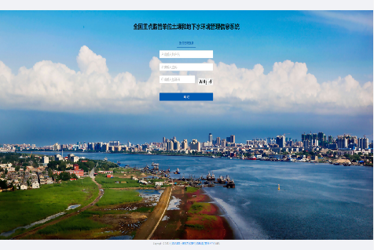
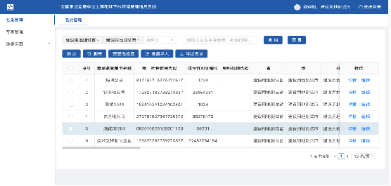
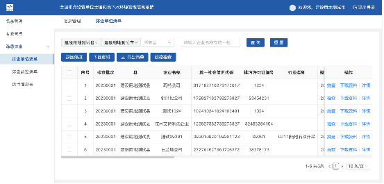
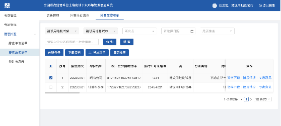
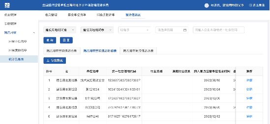

# 智慧环保-重点监管单位

#### 介绍
智慧环保-重点监管单位
系统简介：为贯彻落实《土壤法》有关规定，根据《“十四五”土壤、地下水和农村生态环境保护规划》等文件要求，通过建设全国重点监管单位土壤和地下水环境管理信息系统，实现做好用户管理、名录管理、数据共享、隐患排查、排查质控、查询页面等6大具体业务功能。
使用部门：国家、省、市、县各级环保部门
主要成效：通过重点监管单位模块，已支撑1.6万多用户开展隐患排查工作，极大支持了重点监管单位土壤污染隐患排查指南工作。

商务合作 WeChat: 2609375767
#### 软件架构
软件架构说明

前端：vue

后台：spring-boot

#### 系统截图
1. 登录页

2.名录管理

3. 排查单位清单

4. 排查质控清单

5. 统计信息

